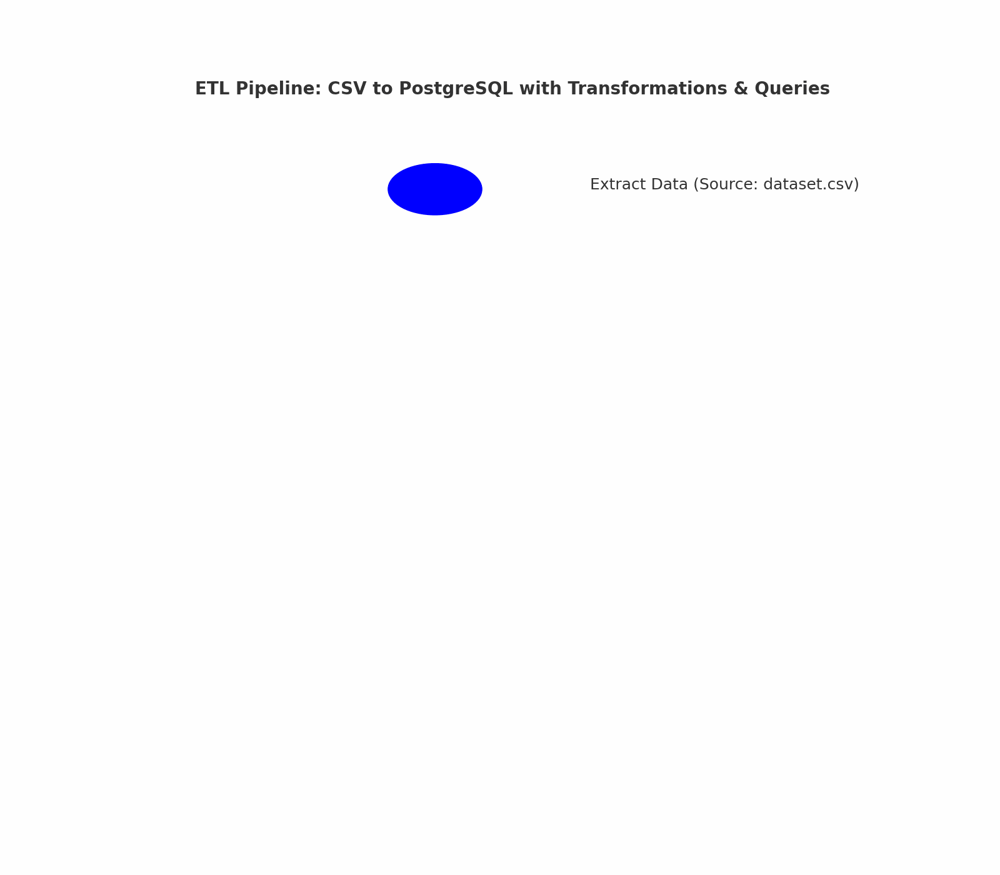

# 📊 ETL Data Pipeline: CSV to SQL

This project demonstrates a complete **Extract, Transform, Load (ETL) pipeline** for processing structured data. The ETL process involves:

 **Extracting** data from a CSV file
 \n **Transforming** the data using Pandas
 **Loading** the cleaned data into a **PostgreSQL database**
 **Running SQL queries** for insights and analysis

## ETL Process Animation
 

This project is structured for modularity, with separate scripts for **extracting, transforming, and loading** data.

---

## 📌 Project Overview

### 🛠️ Technologies Used
- **PostgreSQL** (Database)
- **Python** (Pandas, SQLAlchemy)
- **SQL Queries**
- **PowerShell (for running scripts on Windows)**

### 📂 Project Directory Structure
```
etl-csv-to-sql/
│── data/                     # Raw dataset (CSV)
│── scripts/                   # Python scripts
│   ├── extract_data.py        # Extract CSV data
│   ├── transform_data.py      # Clean & transform data
│   ├── load_data.py           # Load data into PostgreSQL
│── sql/                       # SQL scripts
│   ├── analysis_queries.sql   # SQL queries for analysis
│── setup_postgresql.md        # Guide to setting up PostgreSQL
│── README.md                  # Project documentation
│── requirements.txt           # Python dependencies
```

---

## 🚀 Installation & Setup Guide

### 🔹 1️⃣ Install Dependencies

Ensure you have **Python** installed. Then, install required dependencies:
```powershell
pip install -r requirements.txt
```

Ensure **PostgreSQL is installed** and configured by following [setup_postgresql.md](setup_postgresql.md).

### 🔹 2️⃣ Run ETL Scripts

Run the scripts in order to complete the ETL process:

#### **Extract Data**
```powershell
python scripts/extract_data.py
```
This script reads the dataset from the CSV file.

#### **Transform Data**
```powershell
python scripts/transform_data.py
```
This script cleans and preprocesses the extracted data.

#### **Load Data into PostgreSQL**
```powershell
python scripts/load_data.py
```
This script loads the transformed data into a PostgreSQL database.

### 🔹 3️⃣ Run SQL Analysis Queries

Once the data is loaded, execute analysis queries using PowerShell:
```powershell
psql -U myuser -d etl_project -f "sql/analysis_queries.sql"
```
(Replace `myuser` with your PostgreSQL username.)

To manually run queries inside PostgreSQL:
```powershell
psql -U myuser -d etl_project
```
Then, inside `psql`, run:
```sql
SELECT * FROM movies LIMIT 5;
```

---

## 📊 Example Analysis Queries

**1️⃣ Get the top 5 highest-rated movies:**
```sql
SELECT title, rating FROM movies ORDER BY rating DESC LIMIT 5;
```

**2️⃣ Get the most popular genres (by movie count):**
```sql
SELECT genre, COUNT(*) AS total_movies FROM movies GROUP BY genre ORDER BY total_movies DESC;
```

**3️⃣ Create a summary table of genres and their average ratings:**
```sql
DROP TABLE IF EXISTS genre_summary;
CREATE TABLE genre_summary AS
SELECT genre, COUNT(*) AS total_movies, AVG(rating) AS avg_rating
FROM movies
GROUP BY genre;
```

**4️⃣ View the genre summary table:**
```sql
SELECT * FROM genre_summary;
```

---

## 🔄 Automating the ETL Process
To make the ETL process fully automated, **schedule the Python scripts to run periodically** using:
- **Windows Task Scheduler** (Windows users)
- **Cron Jobs** (Linux/Mac users)

---

## 📌 Deployment
To deploy this project on a cloud database (e.g., AWS RDS, Google Cloud SQL):
1️⃣ Modify `load_data.py` to use the **cloud database connection string**.
2️⃣ Ensure the cloud database allows external connections.
3️⃣ Update `requirements.txt` to include any cloud-related packages.

---

## 🛠️ Troubleshooting

### ❓ PostgreSQL Connection Issues
- Ensure PostgreSQL is **running**: `net start postgresql` (Windows) or `sudo service postgresql start` (Linux).
- Ensure your **username and password** in `load_data.py` match your PostgreSQL credentials.

### ❓ Data Not Loading into PostgreSQL
- Check for **permission errors** and grant privileges:
```sql
ALTER ROLE myuser SET search_path TO public;
GRANT ALL PRIVILEGES ON DATABASE etl_project TO myuser;
```

---

## 🚀 Contributing
If you'd like to contribute, feel free to **fork** the repository, create a new branch, and submit a pull request!

✅ **Author:** Alekhya Ramisetti
📌 **GitHub Repository:** [ETL Data Pipeline](https://github.com/alekhyaramisetti01/etl-csv-to-sql)
